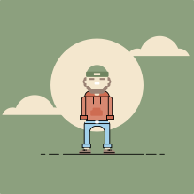
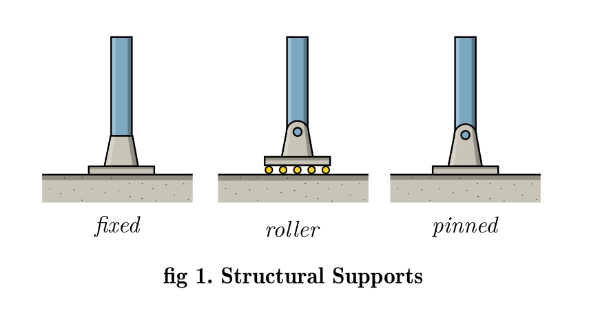

# Vector Design

Things I am learning...

## Exercise 1

In this exercise I am replicating the faces seen in [this tutorial](https://www.youtube.com/watch?v=t1LpFn1OHa0). First I created [a flat colors palette](https://github.com/TheBeachLab/flat-color-palette) for Inkscape. I learned that all the flat faces designs can be created with just circles, bullets and rounded rectangles and a small set of colors.

## Exercise 2

In here I followed [this](https://www.youtube.com/watch?v=xvGP8-FsPMY) character tutorial. This is a different style, with strokes and a different palette . I learned about [svgpathtools](https://github.com/mathandy/svgpathtools) a nice extension for Inkscape to create fillets and chamfers to paths. And also I mastered the division, union and difference of paths.

## Exercise 3 WIP

Drawing Neil Gershenfeld for the first episode of Fab Academy Chronicle. Inspired by [this](https://www.youtube.com/watch?v=VvZGTfNx01M) tutorial.

## Exercise 4

Flat design structural support members. Original SVG [here](structural/structural.svg), it cannot be properly seen on the browser.

